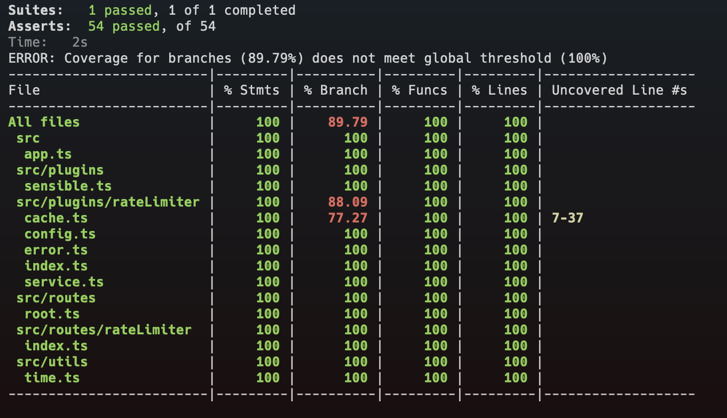

# Fastify Rate Limiter

Please go through the different sections before you start or come back to these if you face any issue

- How to run
- Known Issues
- Limitations
- Features
- Missing Features
- Challenge
- Context
- Proposed Solution
- Tests

## How to run

### Requirements
[x] - Node latest lts
[x] - Redis server running with the default configuration

### Available Scripts

Before you start copy the `.env.EXAMPLE` provided into a new file called `.env`

In the project directory, you can run:

#### `npm run dev`

To start the app in dev mode.\
Open [http://localhost:3003](http://localhost:3003) to view it in the browser.
* You can define a custom `PORT` in `.env`

#### `npm start`

For production mode

#### `npm run test`

Run the test cases.

## Known Issues

There are some known issues that would require more attention and time

- The tests have an erroneous behaviour sometimes this is probably related to "messing" with time (faking clocks)
- "Production build" was not properly tested since I spent all the time in dev environment

## Limitations

- The rate limiter configuration is shared but not the client buckets, this means that the rate limiter works per client <-> server machine individually.
- There is no support to replace the `redis` cache usage por in memory, meaning that you need a `redis` cache to run this project.

## Features

- Apply a rate limit (per machine) to client requests, ready to apply globally (all routes), groups (selected routes) or atomically (per route) in this case the conditional logic in the route is required
- 3 configurable options for the rate limiter - Block list, Time frame and requests limit (this is explained further along)
- Adjust the rate limit config in "runtime", the new config is applied immediately and it resets the current history for all clients
- In case of a rejected request the client receives the time left to be able to perform another request

## Missing Features

There is a lot that we could do but for the purpose of the challenge and my approach these are the most important missing features (that I might still do)

- [ ] Dockerized application
- [ ] Web client with monitor dashboard and interface to change config 

## Challenge

The task is to produce a rate-limiting module that stops a particular requestor from making too many http requests within a particular period of time.

The module should expose a method that keeps track of requests and limits it such that a requester can only make 100 requests per hour. After the limit has been reached, return a 429 with the text "Rate limit exceeded. Try again in #{n} seconds".

Although you are only required to implement the strategy described above, it should be easy to extend the rate limiting module to take on different rate-limiting strategies.

## Context

Presented with the challenge I opted to use fastify to have a Minimalist Node Api, without much experience with fastify itself, I have only used it during the training for the node certifications (applications & services), I could have opted in to use NestJs but I believe is overkill for the challenge presented. With this said I tried to follow some fastify conventions in terms of structure.
Even though it intends to demo a production ready code it would require more time and research to apply it to a real application, but it works :)

## Proposed Solution

The main thing for the challenge would be to choose the rate limiter main algorithm, I opted per a Timer free [Token Bucket](https://en.wikipedia.org/wiki/Token_bucket) algorithm. In terms of trade-offs seemed to me to be a good choice due to the fairness of the process itself and it's memory and timers usage. This is implemented mainly by 2 classes RateLimiter->Bucket[] the first in the form of a singleton, This Rate Limiter class can be considered as the RateLimiter service. This service is then encapsulated (not 100%) in a plugin that contains a hook to intercept all requests in scope, by registering the plugin in different scopes this allow for layers of encapsulation. Not 100% encapsulated - the reason behind this is that the RateLimiter service exposes a method to update the config that can be called from anywhere, here a facade or a proper interface could be an evolution.
A redis cache is used to maintain the Rate Limiter config, this means that the config is shared in clusters if needed but the client buckets part is not, is by machine.
From a 10000 feet view the plugin works as follows:

1 - Plugin is registered in the scope pretended (here by scope I mean all routes, a set of routes or individual route)
2 - Plugin bootstraps with a config set by the following order Hardcoded -> ENV -> Cache
3 - Each request is intercepted on the hook on the plugin
4 - By IP the service check's if the IP is on the blockList, the ip was chosen but inside the service there are no direct references to ip, so any identifier available could be used, ex: some client or tenant id
5 - If the IP is on the blocklist a bucket is created using the active configuration
6 - The way the bucket works in a nutshell is, the bucket is created with a max quantity of tokens, each time a client makes a request a token is consumed if no more tokens exist for the user then the request is denied. The bucket fills continuously at a specific rate, ex: 1 token per minute the max quantity of tokens the user can consume applies to a time frame, ex: 60m, after this time frame is over it starts again.

## Tests

The tests implemented try to assure the service functions as proposed, there are no unit tests, with the time available I opted to test the system as a whole, something like e2e or integration tests

Caveat: I have some concerns about the tests implemented were I would need to review the strategy, testing with system Time is, imo, always a bit complex and I suspect I may have race/order conditions that cause some tests to fail from time to time

